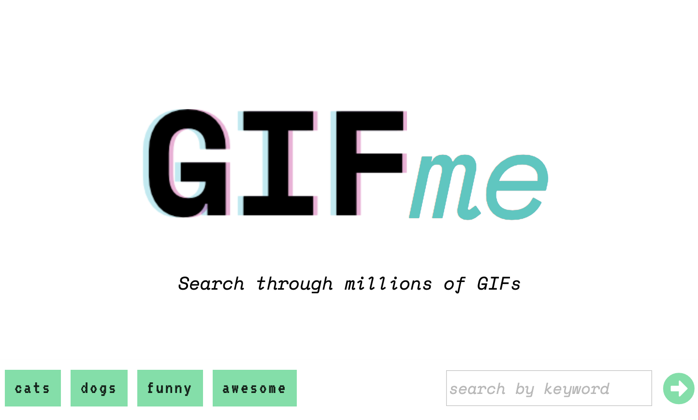

# GIFme

## Description

GIFme uses the GIPHY database to provide the user a limitless amount of gifs to search through. 

When the page first renders a preset list of topics automatically appear as tags the user can click. Clicking a tag will generate 10 gifs related to the topic of that tag. Additionally, more gifs can be loaded by scrolling to the bottom of the page and clicking on the **MORE +** button. 

Tags can be removed by clicking on the small "x" that appears in the upper-right corner of the green box when you hover over a tag. 

The application will block duplicate tags from being submitted. 

## Technologies used

GIFme is a simple app: it's built in **html**, **css** and **javascript**. The **jQuery** library is used for DOM manipulation and **axios** for making calls to the GIPHY api. 

### [View the live deployment](https://adj-dev.github.io/GIFme/)

